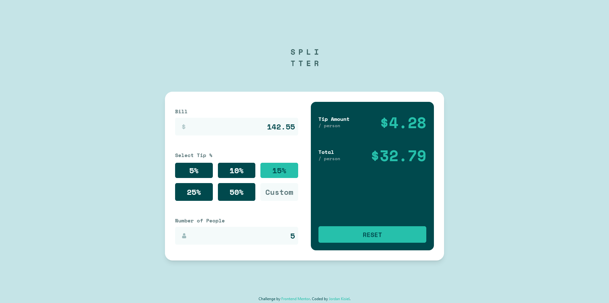

# Frontend Mentor - Tip calculator app solution

This is a solution to the [Tip calculator app challenge on Frontend Mentor](https://www.frontendmentor.io/challenges/tip-calculator-app-ugJNGbJUX). Frontend Mentor challenges help you improve your coding skills by building realistic projects.

## Table of contents

- [Overview](#overview)
  - [The challenge](#the-challenge)
  - [Screenshot](#screenshot)
  - [Links](#links)
- [My process](#my-process)
  - [Built with](#built-with)
  - [What I learned](#what-i-learned)
  - [Continued development](#continued-development)
  - [Useful resources](#useful-resources)
- [Author](#author)
- [Acknowledgments](#acknowledgments)

## Overview

### The challenge

Users should be able to:

- View the optimal layout for the app depending on their device's screen size
- See hover states for all interactive elements on the page
- Calculate the correct tip and total cost of the bill per person

### Screenshot

### Links

- Live Site URL: [https://jordankisiel.github.io/tip-calculator/](https://jordankisiel.github.io/tip-calculator/)

## My process

### Built with

- Semantic HTML5 markup
- Flexbox
- CSS Grid
- Mobile-first workflow
- Vanilla JS
- [Tailwind](https://tailwindcss.com/)

### What I learned

The bulk of my learning during this project consisted of handling and validating input from the user using JS. In particular, I was pleased with my ability to prevent the user from inputing nonsenscical values as this drastically improved the UX.

I had planned to implement a more functional approach in my JS code but found it difficult and clunky. The callback functions seem to naturally want to have side effects as the behavior of the UI elements are tied to each other. For instance, selecting an option with a button meant that not only its appearance had to change but also the appearance of the previously selected buttons. Regardless, I was generally able to write the helper functions I used in my callbacks in a more functional style and this did seem to keep the code cleaner and more straightfoward.

### Continued development

Despite the fact that my JS code was cleaner and more straightfoward than it was in my previous project, I still think that given a more complex project, it would untenable to take the same approach. At some point within the next few projects I intend learn and try using React to see if such a framework will provide a better approach.

## Author

- Website - [Jordan Kisiel](http://robojojo.co/)
- Frontend Mentor - [@JordanKisiel](https://www.frontendmentor.io/profile/JordanKisiel)
- Twitter - [@JordanKisiel](https://www.twitter.com/JordanKisiel)
